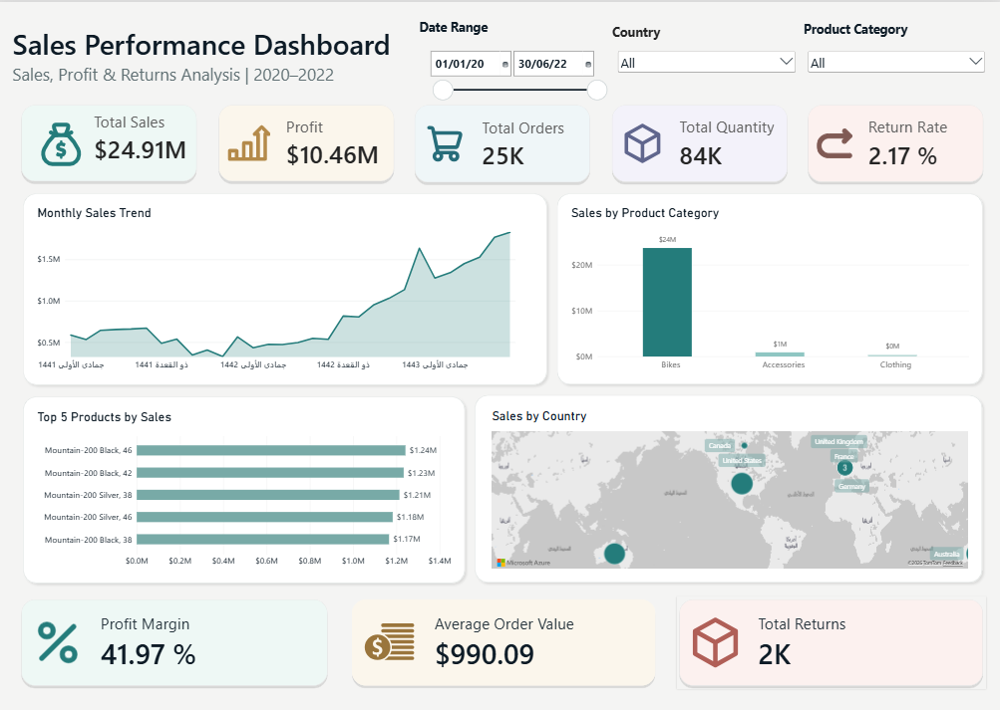

# Sales Performance Dashboard | Power BI

An interactive Power BI dashboard for analyzing sales performance, profitability, orders, product categories, and returns across countries from 2020 to 2022.

## Interactive Dashboard

[View Interactive Dashboard](https://app.powerbi.com/view?r=eyJrIjoiZmE5NTFiY2UtNWIxMS00NTMyLThiNzMtMmMyZDdmZDc5YzE2IiwidCI6ImUyNmJhYjRiLTk3ZTYtNDc1NC1iMTYzLTYwZjgyMzdlODUzMSIsImMiOjl9&pageName=3b7ac55658bb636b4c28)

## Dashboard Preview

## Key Performance Indicators

| Metric              |   Value |
| ------------------- | ------: |
| Total Sales         | $24.91M |
| Total Profit        | $10.46M |
| Total Orders        |     25K |
| Total Quantity      |     84K |
| Return Rate         |   2.17% |
| Profit Margin       |  41.97% |
| Average Order Value | $990.09 |
| Total Returns       |      2K |

## Dashboard Features

* **Sales Trend Analysis:** Explore monthly sales performance over time.
* **Product Category Analysis:** Compare sales across product categories.
* **Top 5 Products:** Identify the five products with the highest sales.
* **Geographical Analysis:** Explore sales distribution across countries.
* **Interactive Filters:** Filter the report by date range, country, and product category.
* **Performance Overview:** Monitor key sales, profit, order, quantity, and return metrics.

## Tools & Technologies

* Microsoft Power BI
* DAX
* Power Query

## Project Files

The repository includes the Power BI project file and its associated report and semantic model folders.

## Getting Started

1. Clone or download this repository.
2. Open `Sales Performance Dashboard.pbip` in Power BI Desktop.
3. If prompted, configure the required data source and refresh the data.
4. Explore the report using the interactive filters.

## Notes

* KPI values represent the figures displayed in the dashboard.
* Data source details and refresh requirements should be documented according to the actual project setup.

