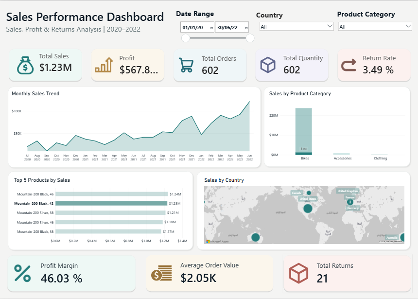

# Sales Performance Dashboard | Power BI

An interactive Power BI dashboard for analyzing sales performance, profitability, orders, product categories, and returns across countries from January 2020 to June 2022.

## Interactive Dashboard

[View Interactive Dashboard](https://app.powerbi.com/view?r=eyJrIjoiMzg4ZmMyMjQtZDdlZS00NTE5LWJhOTUtZjhlMmZlMzAyNDhkIiwidCI6ImUyNmJhYjRiLTk3ZTYtNDc1NC1iMTYzLTYwZjgyMzdlODUzMSIsImMiOjl9)
## Dashboard Preview



## Key Performance Indicators

| Metric              |   Value |
| ------------------- | ------: |
| Total Sales         | $24.91M |
| Total Profit        | $10.46M |
| Total Orders        |     25K |
| Total Quantity      |     84K |
| Return Rate         |   2.17% |
| Profit Margin       |  41.97% |
| Average Order Value | $990.09 |
| Total Returns       |      2K |

## Key Insights

* **Bikes drive most of the revenue:** the Bikes category is far ahead of Accessories and Clothing in total sales.
* **Sales grow over time:** monthly sales show a clear upward trend, with the highest values in the most recent months.
* **Strong profitability:** the profit margin is 41.97% on $24.91M in total sales.
* **Low return rate:** only 2.17% of orders are returned.
* **Top sellers are Mountain-200 models:** the five best-selling products are all Mountain-200 variants.

## Dashboard Features

* **Sales Trend Analysis:** Explore monthly sales performance over time.
* **Product Category Analysis:** Compare sales across product categories.
* **Top 5 Products:** Identify the five products with the highest sales.
* **Geographical Analysis:** Explore sales distribution across countries.
* **Interactive Filters:** Filter the report by date range, country, and product category.
* **Performance Overview:** Monitor key sales, profit, order, quantity, and return metrics.

## Tools & Technologies

* Microsoft Power BI
* DAX
* Power Query

## Project Structure

```
sales-performance-dashboard/
├── dashboard/   # Power BI report file (.pbix)
├── data/        # Data files used by the dashboard
├── images/      # Dashboard preview image
├── LICENSE
└── README.md
```

## Getting Started

1. Clone or download this repository.
2. Open `dashboard/Sales Performance Dashboard.pbix` in Power BI Desktop.
3. If prompted, point the data source to the files in the `data/` folder and refresh the data.
4. Explore the report using the interactive filters.

## Notes

* KPI values represent the figures displayed in the dashboard for the period Jan 2020 – Jun 2022.
* Month labels use a calculated `Month Year` column (sorted by `Month Sort`) so the trend chart displays Gregorian months regardless of the system calendar.

## Author

**Shaima Nabeel Albokhari**

## License

Released under the [MIT License](LICENSE).
